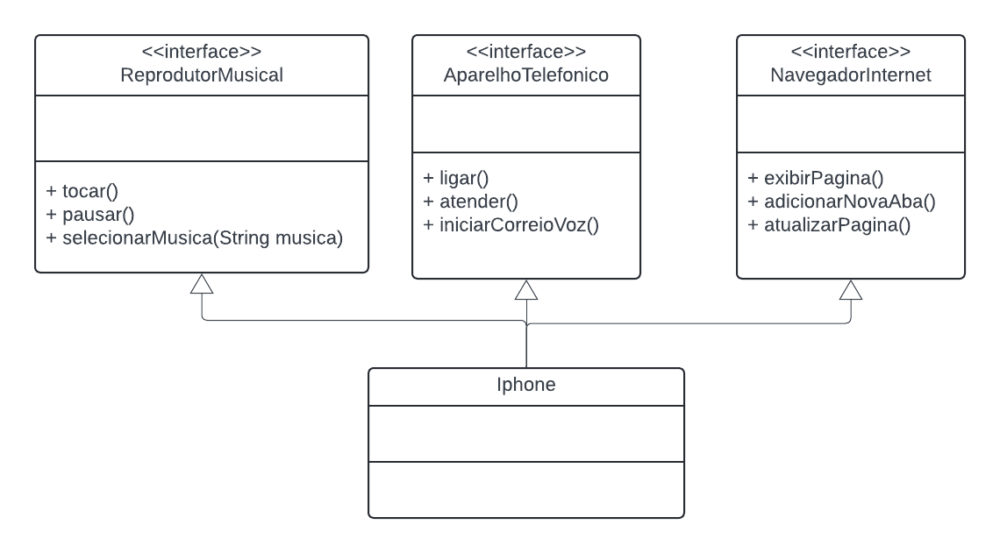

# General

DIO challenge: Iphone simplified modeling

# Artifacts

Here we have an iPhone class, some interfaces and the class diagram. For the code please see the `src` directory. For the image diagram (and the exported and the online version), please see this document.

I used [Lucida chart](https://lucid.app/) to make the diagram.

# Diagram

[Online link](https://lucid.app/lucidchart/f5644daa-a697-43ed-bec6-a6751f5977d0/edit?invitationId=inv_d52ca317-8cd9-46c4-a0d6-82b224e826c0)

[Exported file](docs/csv/UMLiPhoneDIO.csv)

